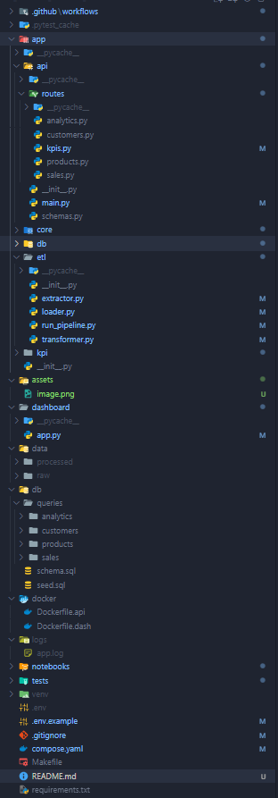
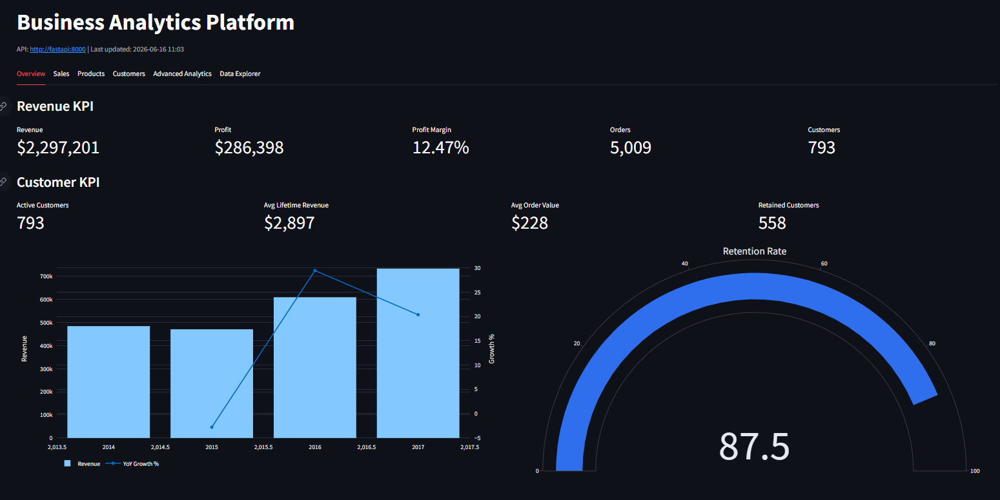
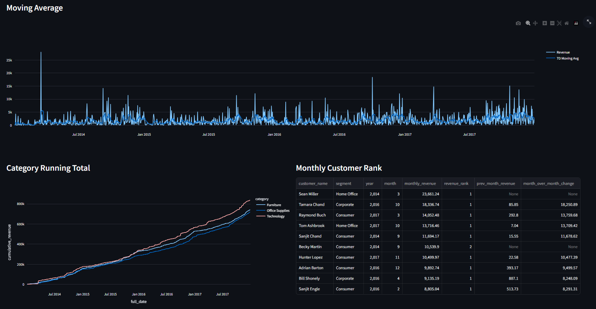
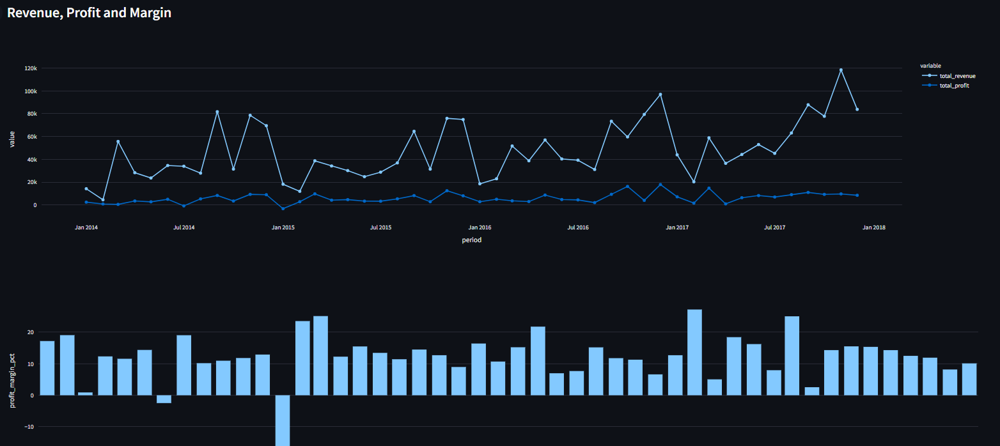
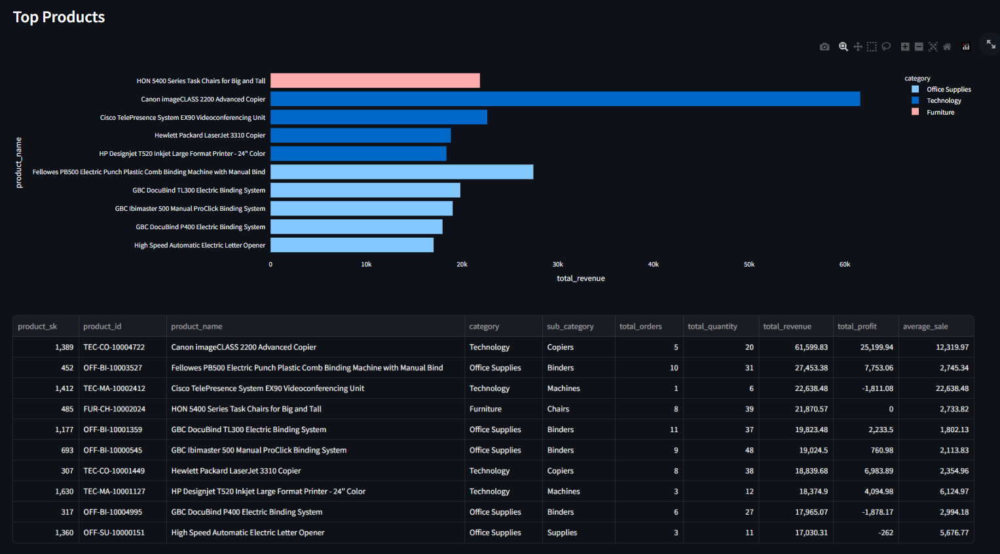
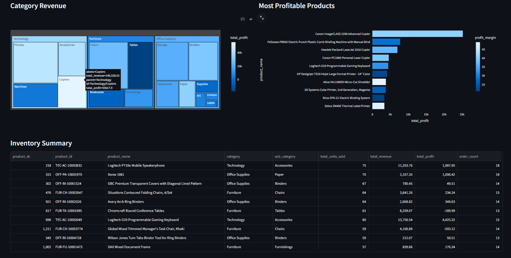
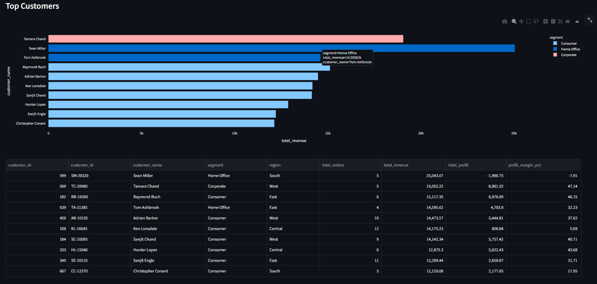

# Business Analysis Platform

Business Analysis Platform is an end-to-end analytics project built around the Superstore sales dataset. It loads raw CSV data, transforms it into a PostgreSQL star schema, exposes typed analytics endpoints with FastAPI, and presents KPIs and exploratory views in a Streamlit dashboard.

The project is designed as a portfolio-ready example of a small business intelligence stack: ETL, dimensional modeling, SQL analytics, API contracts, dashboarding, testing, and Docker-based deployment.

## Features

- CSV ingestion with encoding fallback for real-world source files.
- ETL pipeline that builds customer, product, date, and sales fact tables.
- PostgreSQL warehouse with indexes and materialized views.
- FastAPI analytics layer with Pydantic response models and OpenAPI documentation.
- Streamlit dashboard covering revenue, customers, products, growth, retention, moving averages, rollups, cubes, and materialized views.
- EDA notebook with data quality checks, sales analysis, discount analysis, and processed output generation.
- Automated tests for API contracts, schemas, ETL transformations, and endpoint behavior.
- Docker Compose setup for PostgreSQL, FastAPI, and Streamlit.

## Architecture

```text
data/raw/superstore.csv
        |
        v
app/etl/run_pipeline.py
        |
        v
PostgreSQL star schema
  - dim_customer
  - dim_product
  - dim_date
  - fact_sales
  - materialized views
        |
        v
FastAPI analytics API (:8000)
        |
        v
Streamlit dashboard (:8501)
```

## Project Structure



## Data Folders

`data/raw/` contains source files and should be treated as immutable input.

`data/processed/` should not be a mystery folder or a permanent dumping ground. In this project it is used for reproducible, analysis-ready extracts generated from the EDA notebook, such as:

- `clean_superstore.csv`
- `monthly_revenue.csv`
- `yearly_growth.csv`
- `revenue_by_region.csv`
- `category_sales.csv`
- `top_products.csv`
- `top_customers.csv`
- `discount_impact.csv`
- `shipping_summary.csv`

These files are generated artifacts and are ignored by Git. Regenerate them from `notebooks/eda.ipynb` whenever the raw data changes.

## Requirements

- Python 3.11 or newer
- Docker Desktop
- Make, or the ability to run the equivalent commands manually

## Dataset Selection

Kaggle: Sample Superstore Sales Dataset

> **Link: https://www.kaggle.com/datasets/vivek468/superstore-dataset-final**

Install Python dependencies locally:

```bash
python -m venv venv
venv\Scripts\activate
pip install -r requirements.txt
```

On macOS/Linux, activate with:

```bash
source venv/bin/activate
```

## Environment

Create a local `.env` file from the example:

```bash
copy .env.example .env
```

For local Python commands that connect to PostgreSQL through the host port, use:

```env
POSTGRES_DB=analytics
POSTGRES_USER=admin
POSTGRES_PASSWORD=elantra12
POSTGRES_HOST=localhost
POSTGRES_PORT=5432
```

Inside Docker Compose, the FastAPI container overrides the database host to `postgres`, so the same project can run both locally and in containers.

## Quick Start with Docker

Start PostgreSQL, FastAPI, and Streamlit:

```bash
docker compose up --build -d
```

Run the ETL pipeline inside Docker:

```bash
make etl-docker
```

Open:

- API docs: http://localhost:8000/docs
- Dashboard: http://localhost:8501

If `make etl-docker` fails with a Docker pipe error such as `dockerDesktopLinuxEngine ... The system cannot find the file specified`, Docker Desktop is not running. Start Docker Desktop first, wait until the engine is ready, then run the command again.

## Local Development Workflow

Start only PostgreSQL with Docker:

```bash
docker compose up -d postgres
```

Run ETL locally:

```bash
make etl
```

Start the API:

```bash
venv\Scripts\python.exe -m uvicorn app.api.main:app --reload --host 127.0.0.1 --port 8000
```

Start the dashboard:

```bash
venv\Scripts\streamlit.exe run dashboard/app.py
```

## ETL Pipeline

The ETL pipeline is implemented in `app/etl/run_pipeline.py`.

It performs the following steps:

1. Reads `data/raw/superstore.csv`.
2. Falls back across common encodings when UTF-8 fails.
3. Normalizes column names.
4. Parses order and shipping dates.
5. Builds `dim_customer`, `dim_product`, and `dim_date`.
6. Loads dimensions with upsert behavior.
7. Maps natural keys to surrogate keys.
8. Truncates and reloads `fact_sales` as a full refresh.
9. Refreshes materialized views.

Run it locally:

```bash
make etl
```

Run it inside Docker:

```bash
make etl-docker
```

## API Endpoints

System:

| Method | Path      | Description             |
| ------ | --------- | ----------------------- |
| GET    | `/`       | API root                |
| GET    | `/health` | API and database health |



KPIs:

| Method | Path                                            | Description                                |
| ------ | ----------------------------------------------- | ------------------------------------------ |
| GET    | `/kpis/revenue`                                 | Revenue, profit, orders, customers, margin |
| GET    | `/kpis/revenue?year=2017`                       | Revenue KPI filtered by year               |
| GET    | `/kpis/growth`                                  | Year-over-year growth                      |
| GET    | `/kpis/retention?base_year=2016&next_year=2017` | Customer retention                         |

> Moving Average



Sales:

| Method | Path                       | Description                |
| ------ | -------------------------- | -------------------------- |
| GET    | `/sales/monthly_revenue`   | Monthly revenue summary    |
| GET    | `/sales/daily_sales`       | Daily sales trend          |
| GET    | `/sales/revenue_by_region` | Regional sales performance |

> Margin - Profit



Products:

| Method | Path                       | Description                       |
| ------ | -------------------------- | --------------------------------- |
| GET    | `/products/top_products`   | Top products by revenue           |
| GET    | `/products/category_sales` | Category and sub-category revenue |
| GET    | `/products/inventory`      | Product sales summary             |
| GET    | `/products/{product_id}`   | Product detail                    |

> Top Products



> Category revenue - Most profitables - Inventory Sum
> 

Customers:

| Method | Path                              | Description             |
| ------ | --------------------------------- | ----------------------- |
| GET    | `/customers/`                     | Top customers           |
| GET    | `/customers/top_customer`         | Top customers alias     |
| GET    | `/customers/lifetime`             | Customer lifetime value |
| GET    | `/customers/{customer_id}/orders` | Customer order history  |

> Top Customers



Analytics:

| Method | Path                                           | Description                        |
| ------ | ---------------------------------------------- | ---------------------------------- |
| GET    | `/analytics/window/monthly_rank`               | Monthly customer ranking           |
| GET    | `/analytics/window/category_running_total`     | Category running total             |
| GET    | `/analytics/window/moving_average`             | Seven-day moving average           |
| GET    | `/analytics/rollup_cube/revenue_rollup`        | Revenue rollup                     |
| GET    | `/analytics/rollup_cube/category_cube`         | Segment, category, and region cube |
| GET    | `/analytics/rollup_cube/most_benefit_products` | Most profitable products           |
| GET    | `/analytics/materialized/monthly_revenue`      | Materialized monthly revenue       |
| GET    | `/analytics/materialized/customer_summary`     | Materialized customer summary      |

## Dashboard

The Streamlit dashboard includes:

- Revenue KPI cards
- Customer KPI cards
- YoY growth chart
- Retention gauge
- Revenue and profit trends
- Profit margin analysis
- Regional revenue
- Top products
- Category revenue treemap
- Most profitable products
- Top customers
- Customer lifetime table
- Moving average
- Running total
- Rollup and cube tables
- Data Explorer for all routed analyses

## EDA Notebook

Open `notebooks/eda.ipynb` to run exploratory analysis on the raw CSV.

The notebook covers:

- Source loading with encoding fallback
- Schema normalization
- Data quality checks
- Missing values and duplicate checks
- Executive KPIs
- Monthly and yearly revenue
- YoY growth
- Region, segment, category, product, and customer analysis
- Discount and loss analysis
- Shipping analysis
- Processed CSV output generation

## Tests

Run the full suite:

```bash
make test
```

Current coverage includes:

- API endpoint availability
- API response contracts
- Pydantic/OpenAPI schema registration
- KPI behavior
- ETL transformation behavior
- CSV encoding fallback
- Product not-found behavior
- Customer order contract

## Useful Commands

| Command           | Description                      |
| ----------------- | -------------------------------- |
| `make up`         | Start Docker services            |
| `make down`       | Stop Docker services             |
| `make build`      | Build Docker images              |
| `make etl`        | Run ETL locally                  |
| `make etl-docker` | Run ETL inside Docker            |
| `make test`       | Run pytest                       |
| `make lint`       | Run flake8                       |
| `make logs`       | Follow Docker logs               |
| `make clean`      | Stop services and remove volumes |

## Troubleshooting

### Docker pipe error on Windows

If you see:

```text
open //./pipe/dockerDesktopLinuxEngine: The system cannot find the file specified
```

Docker Desktop is not running or the Linux engine is not ready. Start Docker Desktop and wait until `docker info` works.

### Dashboard shows 500 errors

The Streamlit dashboard calls the FastAPI service. A dashboard 500 usually means the API cannot query PostgreSQL.

Check:

```bash
docker compose ps
docker compose logs fastapi
docker compose logs postgres
```

Then rerun:

```bash
make etl-docker
```

### Local API cannot connect to PostgreSQL

For local Python processes, `.env` should use:

```env
POSTGRES_HOST=localhost
POSTGRES_PORT=5432
```

For Docker containers, Compose overrides the host to `postgres`.

## Notes

This repository intentionally keeps raw and processed data out of Git. The folder structure is part of the project, but generated data files should be recreated from the ETL pipeline or notebook instead of committed.
